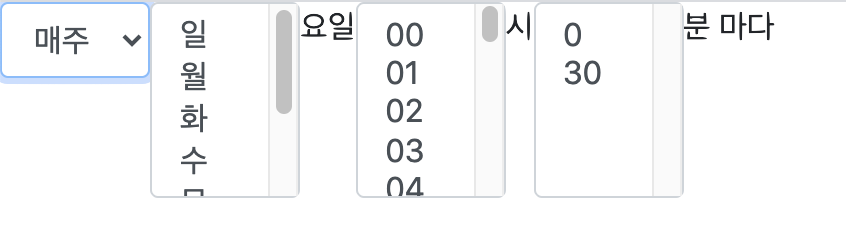

  <a href="https://www.npmjs.com/package/ngx-cron-ui" target="_blank"></a> <a href="https://github.com/Digoro/ngx-cron-ui/blob/master/projects/ngx-cron-ui/README.md" target="_blank"></a>

<h3 align=center>
cron 문법을 사용하여 스케줄을 입력할 수 있는 Angular 모듈
</h3>

-----
<p align=center>

</p>


## Install
### npm
```bash
$ npm install --save ngx-cron-ui
```

## Get started
```ts
import { NgxCronUiModule } from 'ngx-cron-ui';

@NgModule({
  imports: [
    NgxCronUiModule
  ]
})
```

